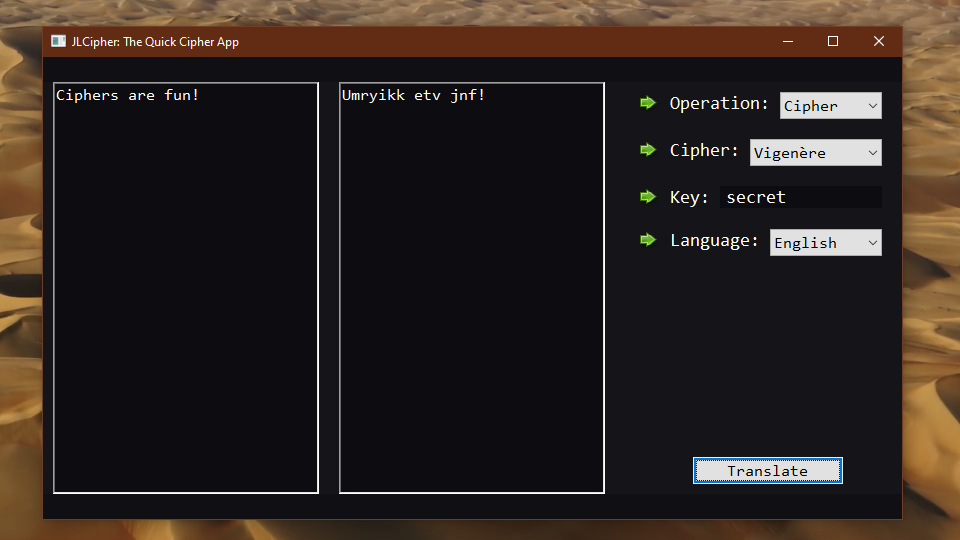

# 🌵JLCipher🌵

As a fan of everything ***spy*** I've decided to create JLCipher - a small python app for ciphering (and deciphering) text. It will possibly also display encodings and other niche things in the future.

#
## Current State:
### Supported Languages
* English
* Bulgarian

### Supported Ciphers
* Caesar cipher
* Vigenère cipher

#
## Planned features:

* More languages
* More ciphers (including ciphers not requiring language selection)
* CLI Support
* Working with files
* Running from an executable
* Light Theme (and possibly other themes)
* Custom cipher configurations