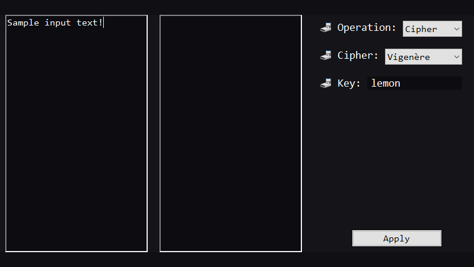
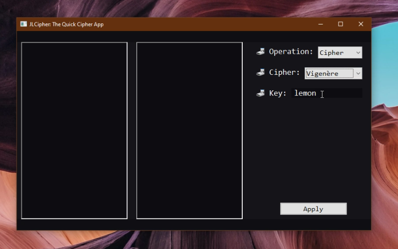
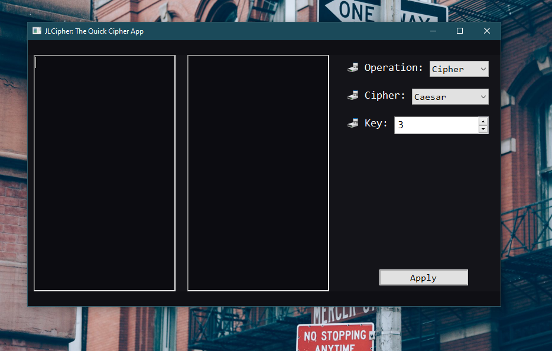
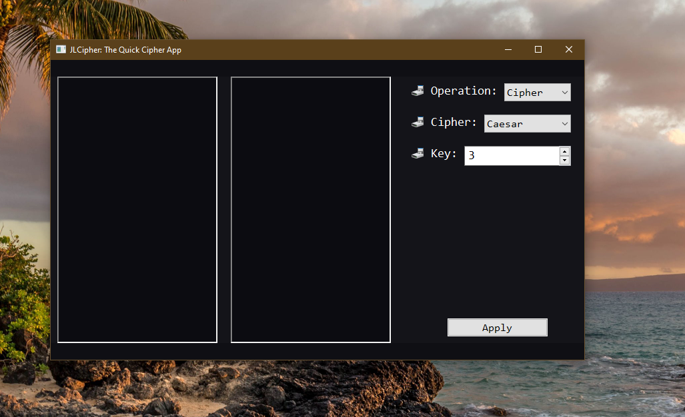

# JLCipher

🌵 👷🏻 **Still Work In Progress** 👷🏻 🌵

As a fan of everything ***spy*** I've decided to create JLCipher - a small app for ciphering (and deciphering) text. It will possibly also display encodings and other niche things in the future.

#

To-Be Supported Ciphers:
* **Caesar Cipher**
* **Vigenère Cipher**
* **Unrestricted Caesar Cipher** - Shifts across the entirety of Unicode
* **Unrestricted Vigenère Cipher** - Shifts across the entirety of Unicode

Planned features:
* CLI Support
* Working with files
* Running from an executable
* Light Theme (and possibly other themes)

#

